# 3150N Nighthawks Website - AWS Architecture

## Overview

This document outlines the AWS architecture for the 3150N Nighthawks VEX V5 team website. The architecture prioritizes **mobile-first performance**, **low operational overhead**, and **cost efficiency** using AWS native services.

| Attribute | Value |
|-----------|-------|
| **AWS Profile** | `rdp` |
| **Region** | `ca-central-1` (Canada) |
| **Content Refresh** | Every 4 hours |
| **Architecture Type** | Static site with scheduled content updates |

---

## Architecture Diagram

```mermaid
flowchart TB
    subgraph Users
        Mobile[📱 Mobile Users]
        Desktop[💻 Desktop Users]
    end

    subgraph AWS["AWS Cloud (rdp profile)"]
        subgraph Edge["Edge Layer"]
            R53[Route 53<br/>DNS & Domain]
            CF[CloudFront<br/>CDN]
        end

        subgraph Hosting["Hosting Layer"]
            S3Web[S3 Bucket<br/>Static Website]
        end

        subgraph Content["Content Update Layer"]
            EB[EventBridge<br/>Scheduler]
            Lambda[Lambda<br/>Content Fetcher]
            S3Data[S3 Bucket<br/>Content Data]
        end

        subgraph Storage["Asset Storage"]
            S3Assets[S3 Bucket<br/>Media Assets]
        end
    end

    subgraph External["External Sources"]
        VEX[VEX Events API]
        Social[Social Media APIs]
    end

    Mobile --> R53
    Desktop --> R53
    R53 --> CF
    CF --> S3Web
    S3Web --> S3Assets
    S3Web --> S3Data

    EB -->|"Every 4 hours"| Lambda
    Lambda --> VEX
    Lambda --> Social
    Lambda --> S3Data
    Lambda --> CF
```



---

## AWS Services

### 1. Domain & DNS - Route 53

| Configuration | Value |
|---------------|-------|
| **Service** | Amazon Route 53 |
| **Hosted Zone** | Public |
| **Record Types** | A (Alias to CloudFront), AAAA, CNAME |

**Features:**
- Domain registration and management
- Health checks and failover routing
- Low-latency DNS resolution

---

### 2. Content Delivery - CloudFront

| Configuration | Value |
|---------------|-------|
| **Service** | Amazon CloudFront |
| **Origin** | S3 Static Website Bucket |
| **Price Class** | `PriceClass_100` (North America & Europe) |
| **Cache TTL** | 4 hours (aligned with content refresh) |
| **SSL/TLS** | AWS Certificate Manager (ACM) |

**Features:**
- Global edge caching for mobile-first performance
- Automatic HTTPS with ACM certificate
- Cache invalidation on content updates
- Compression (Gzip, Brotli) enabled

---

### 3. Static Website Hosting - S3

| Bucket | Purpose |
|--------|---------|
| `3150n-nighthawks-website` | Static website files (HTML, CSS, JS) |
| `3150n-nighthawks-assets` | Media assets (images, videos) |
| `3150n-nighthawks-data` | Dynamic content data (JSON) |

**Configuration:**
```
├── Website Bucket
│   ├── index.html
│   ├── css/
│   ├── js/
│   └── error.html
├── Assets Bucket
│   ├── images/
│   ├── videos/
│   └── thumbnails/
└── Data Bucket
    ├── competitions.json
    ├── events.json
    └── robots.json
```

**Bucket Policy Features:**
- OAC (Origin Access Control) for CloudFront
- Versioning enabled for rollback
- Lifecycle rules for old versions

---

### 4. Scheduled Content Updates - EventBridge + Lambda

| Configuration | Value |
|---------------|-------|
| **Scheduler** | Amazon EventBridge Scheduler |
| **Schedule** | `rate(4 hours)` |
| **Runtime** | Python 3.12 or Node.js 20.x |
| **Timeout** | 5 minutes |
| **Memory** | 512 MB |

**EventBridge Rule:**
```json
{
  "Schedule": "rate(4 hours)",
  "Target": "arn:aws:lambda:ca-central-1:ACCOUNT_ID:function:nighthawks-content-updater"
}
```

**Lambda Function Workflow:**


**Content Sources:**
| Source | Data Type | Refresh Priority |
|--------|-----------|------------------|
| VEX RobotEvents API | Competition schedules, results | High |
| YouTube Data API | Robot reveal videos | Medium |
| TikTok/Instagram | Viral clips (via approved scraping) | Medium |
| Manual CMS | Team roster, profiles | On-demand |

---

### 5. Certificate Management - ACM

| Configuration | Value |
|---------------|-------|
| **Service** | AWS Certificate Manager |
| **Region** | `us-east-1` (required for CloudFront) |
| **Validation** | DNS (via Route 53) |
| **Certificate Type** | Wildcard (`*.your-domain.com`) |

---

## Data Flow

### Static Content Serving
```
User Request → Route 53 → CloudFront Edge → S3 Website Bucket
```

### Content Update (Every 4 Hours)
```
EventBridge (rate 4h) → Lambda → External APIs → S3 Data Bucket → CloudFront Invalidation
```

---

## Security Architecture

| Layer | Security Control |
|-------|------------------|
| **Edge** | AWS WAF (optional), CloudFront geo-restrictions |
| **Transport** | TLS 1.2+ enforced, HTTPS redirect |
| **Storage** | S3 bucket policies, OAC, encryption at rest (SSE-S3) |
| **Compute** | Lambda execution role with least privilege |
| **Secrets** | AWS Secrets Manager for API keys |

**IAM Roles:**


---

## Cost Estimate (Monthly)

| Service | Usage Estimate | Cost |
|---------|----------------|------|
| Route 53 | 1 hosted zone + queries | ~$1 |
| CloudFront | 10 GB transfer, 100K requests | ~$2 |
| S3 | 5 GB storage, standard tier | ~$0.15 |
| Lambda | 180 invocations/month (4h × 30d) | ~$0 (free tier) |
| EventBridge | 180 invocations/month | ~$0 (free tier) |
| ACM | Free for public certificates | $0 |
| **Total** | | **~$3-5/month** |

> [!NOTE]
> Costs are estimates based on low-traffic hobby site usage. Domain registration is a separate annual fee (~$12-15/year for `.com`).

---

## Deployment Strategy

### Infrastructure as Code (Terraform/AWS CDK)

```
infrastructure/
├── terraform/
│   ├── main.tf
│   ├── variables.tf
│   ├── route53.tf
│   ├── cloudfront.tf
│   ├── s3.tf
│   ├── lambda.tf
│   └── eventbridge.tf
└── lambda/
    └── content-updater/
        ├── index.py
        └── requirements.txt
```

### Deployment Commands

```bash
# Set AWS profile
export AWS_PROFILE=rdp

# Deploy infrastructure
cd infrastructure/terraform
terraform init
terraform plan
terraform apply

# Deploy website content
aws s3 sync ./dist s3://3150n-nighthawks-website --delete

# Invalidate CloudFront cache
aws cloudfront create-invalidation --distribution-id DIST_ID --paths "/*"
```

---

## Content Update Schedule

| Time (UTC) | Action |
|------------|--------|
| 00:00 | Lambda fetches and updates content |
| 04:00 | Lambda fetches and updates content |
| 08:00 | Lambda fetches and updates content |
| 12:00 | Lambda fetches and updates content |
| 16:00 | Lambda fetches and updates content |
| 20:00 | Lambda fetches and updates content |

---

## Monitoring & Alerting

| Metric | Service | Alert Threshold |
|--------|---------|-----------------|
| Lambda Errors | CloudWatch | > 0 errors |
| 4xx/5xx Errors | CloudFront | > 1% error rate |
| S3 Request Errors | S3 Metrics | > 0 errors |
| Lambda Duration | CloudWatch | > 4 minutes |

---

## Future Enhancements

- [ ] **API Gateway** - REST API for team data submissions
- [ ] **DynamoDB** - Store competition results history
- [ ] **Amplify Hosting** - Alternative to S3+CloudFront for CI/CD
- [ ] **SES** - Email notifications for competition updates
- [ ] **Cognito** - Team member authentication for CMS

---

## Quick Reference

| Resource | AWS Service |
|----------|-------------|
| Domain Name | Route 53 |
| CDN / Hosting | CloudFront |
| Static Files | S3 |
| Content Updates | EventBridge + Lambda |
| SSL Certificate | ACM |
| API Keys | Secrets Manager |
| Monitoring | CloudWatch |
